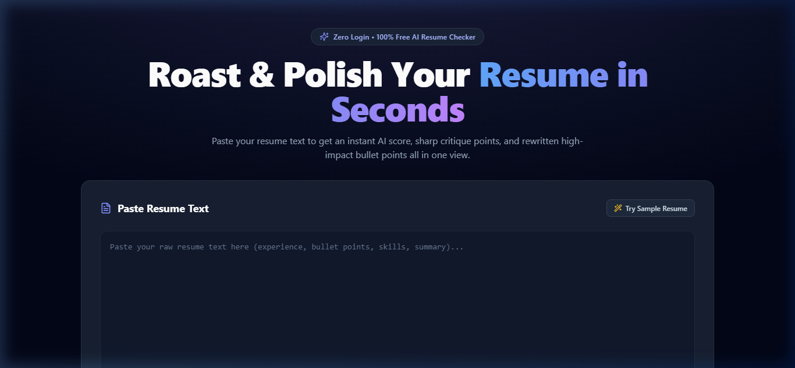
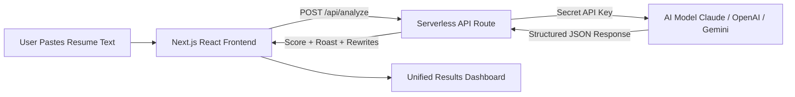

# 🔥 AI Resume Checker & Roaster

> An instant, zero-friction web application that analyzes raw resume text using AI to deliver a numerical score, witty constructive roast critiques, and action-driven STAR bullet point rewrites on a single dashboard screen.

[](https://srb-lake.vercel.app)
[](https://github.com/arpanbasak90-cyber/SRB)

---

## 📸 Preview & Demo



🔗 **Live URL:** [https://srb-lake.vercel.app](https://srb-lake.vercel.app)

---

## 🚀 Features

* **⚡ Zero Friction (No Login / No Database)**: Pure single round-trip evaluation without tedious account creation.
* **🎯 Instant Resume Score & Grade**: Dynamic radial score gauge rating resume impact out of 100 with assigned grades (S, A, B, C, D, F).
* **🔥 Constructive Roast & Critiques**: Sharp, witty bullet points calling out weak phrasing, passive voice, missing quantitative metrics, and fluff.
* **✨ Action-Driven STAR Rewrites**: Before-and-After cards providing ready-to-use, metric-rich bullet rewrites with 1-click **Copy to Clipboard**.
* **🔒 Secure Serverless Backend**: Keeps your AI provider secret API key (`CLAUDE_API_KEY`, `OPENAI_API_KEY`, or `GEMINI_API_KEY`) safe on the server side (`/api/analyze`).
* **🎨 Preview Demo Mode**: Includes an intelligent mock fallback so you can run, test, and demonstrate the full UI flow locally even without an active API key.

---

## 📁 Project Folder Structure

```
SRB/
├── app/
│   ├── api/
│   │   └── analyze/
│   │       └── route.ts         # Serverless API endpoint handling AI analysis & mock fallback
│   ├── globals.css              # Glassmorphism design system & custom gradients
│   ├── layout.tsx               # Root HTML metadata & font layout wrapper
│   └── page.tsx                 # Main single-page interactive UI (Input & Results)
├── components/
│   ├── RewrittenBullets.tsx     # Before/After STAR bullet rewrite cards with 1-click copy
│   ├── RoastList.tsx            # Flame-styled roast points & strengths breakdown
│   └── ScoreGauge.tsx           # Animated SVG radial score meter & grade badge
├── public/
│   └── screenshot.png           # Landing page preview screenshot
├── .env.example                 # Environment variables template
├── next.config.mjs              # Next.js configuration
├── package.json                 # Project dependencies & scripts
├── postcss.config.js            # PostCSS configuration for Tailwind
├── tailwind.config.ts           # Tailwind CSS design system tokens
├── tsconfig.json                # TypeScript configuration
└── README.md                    # Project documentation
```

---

## 📐 Architecture & Flow



---

## 🛠️ Tech Stack

* **Framework**: [Next.js 14](https://nextjs.org/) (App Router)
* **Frontend**: React 18, [Framer Motion](https://www.framer.com/motion/) (Micro-animations), [Lucide Icons](https://lucide.dev/)
* **Styling**: Tailwind CSS & Glassmorphism Design System
* **Backend**: Next.js API Routes (Serverless Function)
* **Hosting**: [Vercel](https://vercel.com/)
* **AI Provider Support**: Anthropic Claude (`claude-3-5-sonnet`), OpenAI (`gpt-4o-mini`), or Google Gemini (`gemini-1.5-flash`)

---

## 📦 Getting Started

### 1. Clone the Repository

```bash
git clone https://github.com/arpanbasak90-cyber/SRB.git
cd SRB
```

### 2. Install Dependencies

```bash
npm install
```

### 3. Configure Environment Variables (Optional for live AI)

Copy `.env.example` to `.env.local`:

```bash
cp .env.example .env.local
```

Add your preferred AI key in `.env.local`:

```env
ANTHROPIC_API_KEY=your_claude_api_key_here
# OR
OPENAI_API_KEY=your_openai_api_key_here
# OR
GEMINI_API_KEY=your_gemini_api_key_here
```

*(Note: If no API key is provided, the application automatically uses Preview Demo Mode with simulated intelligent analysis.)*

### 4. Run the Development Server

```bash
npm run dev
```

Open [http://localhost:3000](http://localhost:3000) in your browser to view the application.

---

## 📄 License

This project is open-source and available under the [MIT License](LICENSE).
